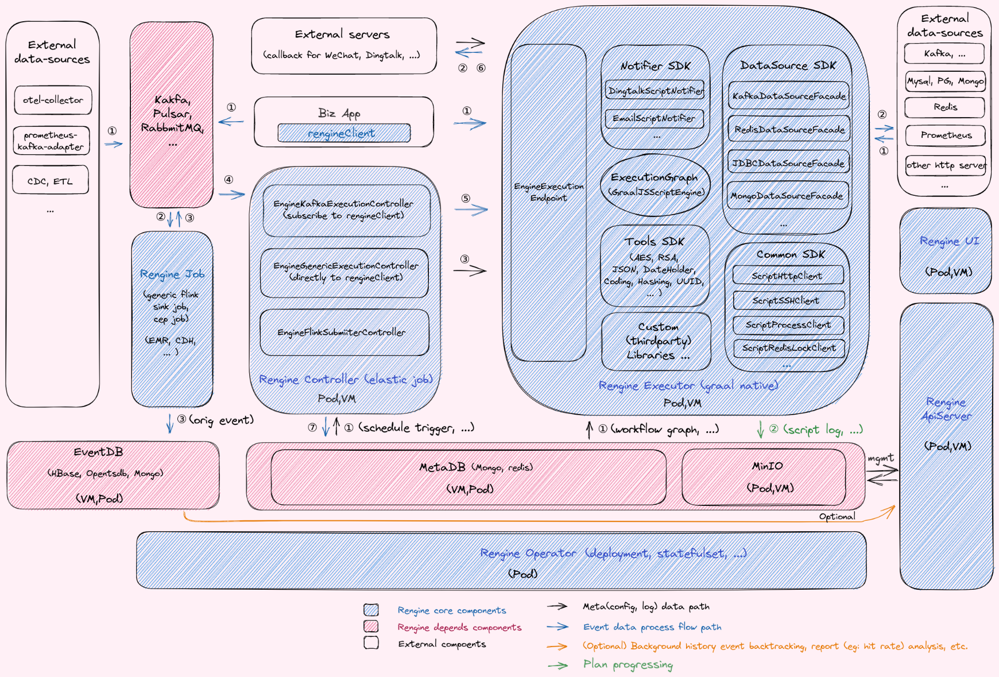

# Rengine

A real-time + near real-time general rule engine platform, suitable for such as financial risk control, real-time alarm of Iot temperature indicators, online data cleaning and filtering, etc.

## Architectures

- 

## Requirements

- JDK 11.x +

- GraalVM-java11-22.1 + (Recommands)

- Maven 3.6 +

- Spring Boot 2.7.3 (Spring 5.3.22)

- Quarkus 2.12.2

- Redis Cluster 5 +

- MongoDB 4.6.x +

- MinIO 2021.x +

- HBase 2.2.x + (Recommands)

- HDFS 3.0.x + (Recommands)

- Flink 1.14.4 + (Recommands)

- Docker 20.x + (Recommands)

- Kubernetes 1.21 + (Recommands)

## Features

- Supports large-scale MMP parallel near real-time aggregation computing based on Flink/CEP.

- Supports multi-language scripting engine for [Groovy](http://groovy-lang.org/differences.html#_default_imports), [JS(graal.js)](https://www.graalvm.org/22.2/reference-manual/js/FAQ/#what-is-the-difference-between-running-graalvms-javascript-in-native-image-compared-to-the-jvm).

- Supports highly flexible dynamic writing rule templates based on WebIDE.

- Supports WebIDE uploading of custom class libraries and automatically completes code prompts.

- Supports automatic analysis of hit rate reports.

- Support [graalvm native mode](https://www.graalvm.org/22.1/docs/getting-started/#native-image) operation (currently supported services: manager/evaluator/collector, future plans to support: flink jobs).

- Supports connecting to [arthas tunnel](https://arthas.aliyun.com/en/doc/tunnel.html) for easy administrator JVM troubleshooting (**Only in JVM run mode**).

## Quick start

- [Rengine Architecture](./docs/en/architecture.md)

- [Deploy for standalone](./docs/en/deploy-standalone.md)

- [Deploy for production](./docs/en/deploy-production.md)

- [Configuration for Clients](./docs/en/configuration-client.md)

- [Configuration for ApiServer](./docs/en/configuration-apiserver.md)

- [Configuration for Scheduler](./docs/en/configuration-scheduler.md)

- [Configuration for Executor](./docs/en/configuration-executor.md)

- [Configuration for Job](./docs/en/configuration-job.md)

- [Development Quide](./docs/en/devel.md)

- [Operation Quide](./docs/en/operation.md)

- [Best Cases examples](./docs/en/best-cases.md)

## RoadMap

- [roadmap](./docs/en/roadmap-2022-23.md)

## FAQ

## If you use the groovy environment, pay attention to the version situation between the components
  - 1. The **groovy-4.0.5**(current latest) that the rengine-evaluator module depends on only supports **jdk1.8/9/10/16**
  - 2. The **spring-native-0.12.1*** (current latest) that the rengine-manager module depends on only supports jdk11+
  - 3. Refer source code: [github.com/apache/groovy/blob/GROOVY_4_0_5/src/main/java/org/codehaus/groovy/vmplugin/VMPluginFactory.java#L39](https://github.com/apache/groovy/blob/GROOVY_4_0_5/src/main/java/org/codehaus/groovy/vmplugin/VMPluginFactory.java#L39)

