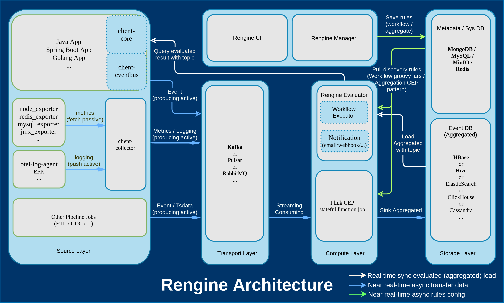

# Rengine

A generic real-time rule engine, such as bank transfer real-time risk control, temperature real-time alarm.

## Architectures

- 

## Requirements

- JDK 11.x +

- Maven 3.6 +

- GraalVM-java11-22.1.0 + (If Necessary)

- MySQL 5.7 +

- MongoDB 4.6.x +

- MinIO 2021.x +

- Flink 1.14.4 + (If Necessary)

- HBase 2.2.x + (If Necessary)

- HDFS 3.0.x + (If Necessary)

- Docker 20.x + (If Necessary)

- Kubernetes 1.21 + (If Necessary)

## Features

- Supports large-scale MMP parallel computing based on FLINK-CEP.

- Supports multi-language scripting engine for `Groovy`, `JS(graal.js)`.

- Supports highly flexible dynamic writing rule templates based on WEBIDE.

- Supports WebIDE uploading of custom class libraries and automatically completes code prompts.

- Supports automatic analysis of hit rate reports.

- Supports register connecting to arthas tunnel for easy administrator JVM troubleshooting.

## Quick start

- [Deploy quide for standalone](./docs/en/deploy-standalone.md)

- [Deploy quide for production](./docs/en/deploy-production.md)

- [Development quide](./docs/en/devel.md)

- [Operation quide](./docs/en/operation.md)

## TODO

- Integrate Arthas (proxy/tunnel) with Rengine Manager for easy troubleshooting by sysadmins

- Improve the Rengine Evaluator(quarkus native) runtime debugging toolchain and documentation, including memory snapshot dumps, real-time thread status dumps

- Add the rengine-operator module to make it auto management to the cloud-native environment?

- Add built-in core metrics (prometheus) and write official metrics alert rules and grafana view rules.

- Supported to Flink CEP(Real-time compute) or Flink SQL(Offline compute)

- Improve Rengine Manager configuration management/UI, friendly to user configuration rules, support online simulation of test data sets

## FAQ

## If you use the groovy environment, pay attention to the version situation between the components
  - 1. The **groovy-4.0.5**(current latest) that the rengine-evaluator module depends on only supports **jdk1.8/9/10/16**
  - 2. The **spring-native-0.12.1*** (current latest) that the rengine-manager module depends on only supports jdk11+
  - 3. Refer source code: [github.com/apache/groovy/blob/GROOVY_4_0_5/src/main/java/org/codehaus/groovy/vmplugin/VMPluginFactory.java#L39](https://github.com/apache/groovy/blob/GROOVY_4_0_5/src/main/java/org/codehaus/groovy/vmplugin/VMPluginFactory.java#L39)

